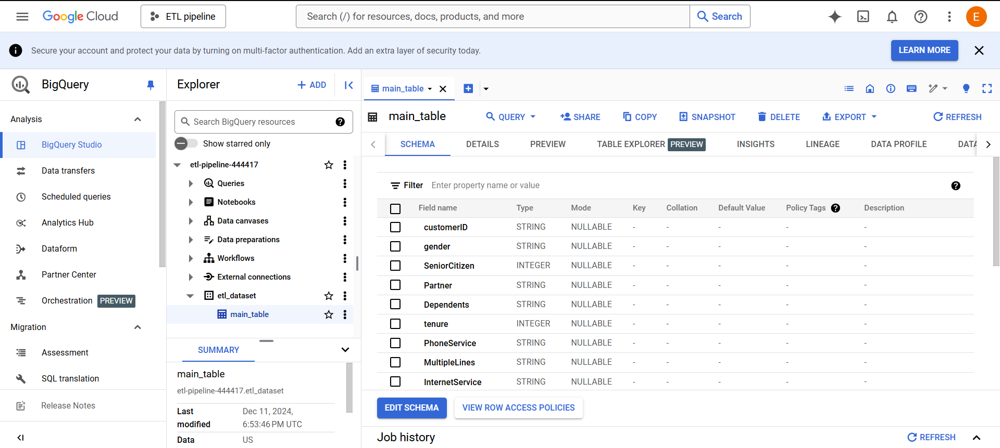
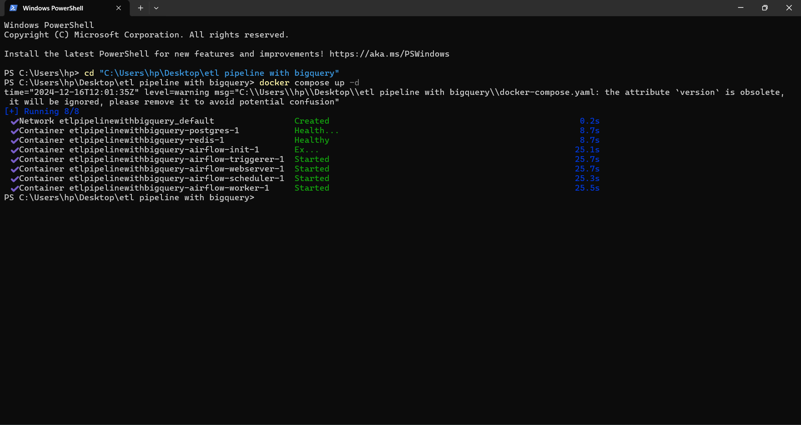
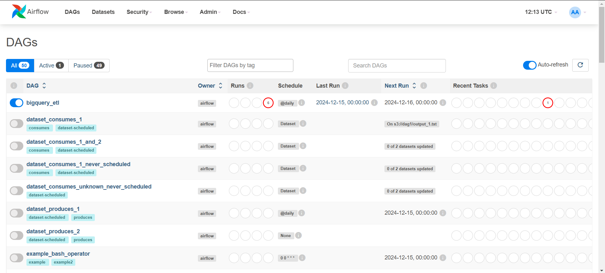
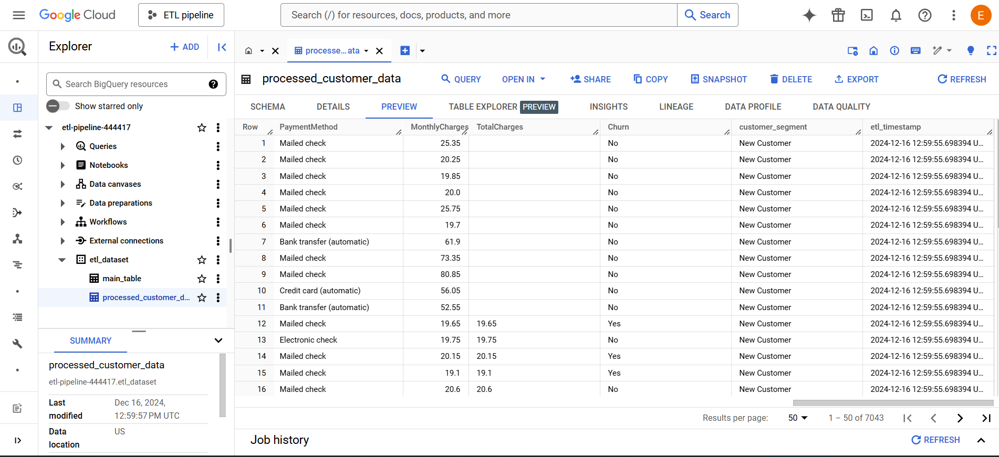

# Bigquery-Airflow-ETL
A robust ETL (Extract, Transform, Load) pipeline that processes telecom customer data using Apache Airflow for orchestration and Google BigQuery for data warehousing. The pipeline includes customer segmentation, automated data quality checks, and daily scheduled updates.


# Telco Customer ETL Pipeline

## Overview
An automated ETL pipeline that processes telecommunications customer data, implementing customer segmentation and data quality checks. Built with Apache Airflow for workflow orchestration and Google BigQuery for data warehousing, this pipeline handles customer demographic information, service subscriptions, and payment analytics.

## Features
* Automated daily data processing with Apache Airflow
* Customer segmentation based on tenure (New, Medium Term, Long Term)
* Comprehensive data quality checks
* BigQuery integration for scalable data warehousing
* Docker containerization for consistent deployment
* Real-time processing timestamps for data freshness tracking

## Architecture
### Tech Stack
* Apache Airflow 2.x
* Google BigQuery
* Docker & Docker Compose
* Python 3.x
* PostgreSQL (Airflow metadata)
* Redis (Airflow message broker)

### Pipeline Components
* Data Extraction: Source system connectivity
* Transformation: Customer segmentation logic
* Loading: BigQuery data warehouse integration
* Orchestration: Airflow DAGs with daily scheduling
* Monitoring: Built-in Airflow task monitoring

## Data Model
### Main Table Schema
* customerID (STRING)
* gender (STRING)
* SeniorCitizen (INTEGER)
* Partner (STRING)
* Dependents (STRING)
* tenure (INTEGER)
* PhoneService (STRING)
* MultipleLines (STRING)
* InternetService (STRING)
* Contract (STRING)

### Processed Customer Data
Additional computed fields:
* customer_segment (New/Medium Term/Long Term)
* etl_timestamp
* PaymentMethod
* MonthlyCharges
* TotalCharges
* Churn status

  ## Pipeline Visualization

### 1. BigQuery Schema and Data Structure
The main table schema in BigQuery shows the customer data structure:


*BigQuery main table schema showing customer attributes*

### 2. Infrastructure Setup
Our pipeline runs on containerized infrastructure using Docker:


*Docker container setup showing Airflow components and dependencies*

### 3. Airflow DAG Overview
The pipeline is orchestrated through Airflow DAGs with daily scheduling:


*Airflow DAG interface showing the ETL pipeline schedule and status*

### 4. Data Processing and Transformation
Example of processed customer data with segmentation:


.png)
*BigQuery processed customer data showing segmentation and additional metrics*

### 5. ETL Task Execution
Successful execution of ETL tasks in Airflow:


*Airflow task execution status showing successful pipeline run*

## Setup and Installation

### Prerequisites
* Docker and Docker Compose
* Google Cloud Platform account
* Python 3.x
* GCP Service Account with BigQuery access

### Local Development Setup
1. Clone the repository:
```bash
git clone https://github.com/yourusername/telco-customer-etl-pipeline.git
cd telco-customer-etl-pipeline
